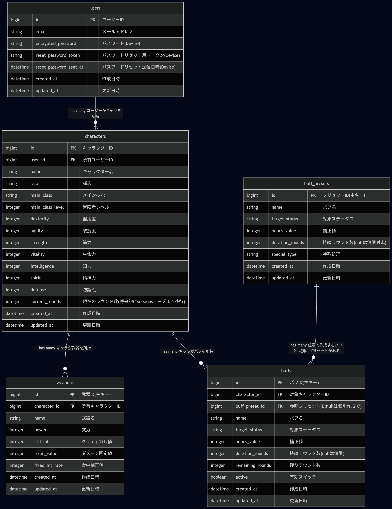

## 1. サービス概要

SW2.5のオンラインセッション中に発生するバフ管理の手間とミスを解消するアプリ。バフの持続時間を自動でカウントし、バフ反映済みの判定式をクリップボードにコピーすることで、CCFOLIAのチャットパレットを書き直す手間なくゲームへの集中を維持できる。

---

## 2. このアイデアはどこから生まれたか

### 2-1. きっかけとなった体験・感情

友人たちとTRPG（サイコロを振りながらキャラクターを演じる会話型ゲーム）を遊んでいた時。

戦闘中、仲間にかけた魔法の効果がすでに切れていたにもかかわらず、その数値を前提にダイスを振り続けていました。後から「あの判定、本当は失敗だったかもしれない」という話になり、ロールバックするか進めるかの議論で時間を取られる結果となった。

ゲームではなくツールの管理に時間を使う場面が増えていることに、違和感を覚えた。

---

### 2-2. なぜそれが「気になった」のか

例えばテレビゲームは大抵の場合、プレイヤーに見える形でバフ・デバフの持続時間が表示されている。TRPGはアナログゲームのためその部分はアナログで管理することが基本である。ただ昨今はネット回線を利用したオンラインセッションが幅広く行われる分、アナログで伝わっていた部分が伝わらなくなり、さらにTRPGもルールの拡充に伴い手作業だけで行うにはキャパシティオーバーな部分が目立ってきている。

さらに、前職で病院に勤めていた経験も気になった原因である。医療の現場ではいつ、何が、どう変わったかを意識しないとミスに直結する。そのためミスを防ぐために仕組みで管理することの重要性を実感していた。

TRPGでのミスに既視感を覚えたのも同じ構造が見えたからだ。状態管理の抜けが判断ミスにつながり、流れを止める。仕組みがあれば防げるのに、TRPGでは手動管理に頼りきりになっているという差が気になった。

---

## 3. 課題の整理（表面的になっていないか）

### 3-1. 表に見えている困りごと

ステータス強化の効果時間を手動で管理しなければならない点。

TRPGでは戦闘中にさまざまな魔法や技能、道具が使用されるが、あの魔法は何ターン有効かという情報は自動で記録されないため、自分でメモを取る必要がある。しかしゲームに集中するほどメモを取り忘れ、取れたとしても管理が追いつかず、気づいたときには効果が切れているはずの数値を使い続けていたというミスが起きる。ミスが発覚すると「あれは本当は失敗だったのでは」という話になり、ロールバックするか進めるかの判断でセッションが止まる。ミスをした本人の気まずさと話の流れが止まる不快感が残る。

---

### 3-2. 本当に解決したい課題は何か

- なぜ困るのか？  
  → ゲームに集中するほど管理が後回しになりミスが起きやすくなるから

- なぜそれが困るのか？  
  → 誤った数値を前提に判定が進み、後からロールバックするか否かという話になるから

- なぜそれが困るのか？  
  → 物語の流れが止まりせっかくの没入感が薄れるから

→ 本当に解決したい課題：ゲームの本質とは無関係なツールの管理に注意と時間を取られてしまう

---

## 4. 想定ユーザーについて

### 4-1. 想定しているユーザー

年齢設定：
  - 年齢：20〜30代
  - 理由：TRPGが活発にプレイされる世代。社会人として確保できるプレイ時間が限られているため、管理ミスによる中断の影響が大きい。

生活・状況設定：
  - 生活・状況：友人と定期的にSW2.5のオンラインセッションをしている社会人または大学生
  - 理由：セッションは事前に時間を確保して臨むものであり、管理ミスによる中断は貴重な時間を削る。アプリで管理の手間を減らすことで、限られた時間をゲーム本来の楽しみに使えるようになる。

環境設定：
  - 環境：CCFOLIAを使いバフ込みの判定式をチャットパレットやチャットに手動で書き込みしながら管理しているプレイヤー
  - 理由：CCFOLIAのチャットパレットは行ごとに判定式を管理するツールで、バフによる数値変化を都度手入力で更新する必要がある。特にSW2.5の近接職は複数の強化効果が重なる場面が多く、判定のたびに式全体を書き直すコストが最も高い。
---

### 4-2. 自分とユーザーの距離

→ 自分自身（および過去の自分に近い立場のプレイヤー）

課題の発端が自分自身のプレイ体験であり、まず自分たちのグループで使うことを想定している。GMも管理負担は大きいが、判定式の書き直しという観点ではSW2.5の場合は近接職プレイヤーが最も頻繁に困るケースが多く、特に慣れていないうちは毎回の判定が手間になりやすい。当事者として開発することで、課題の実感を持ったまま改善を続けられる。

### 4-3. 実際に使われる可能性について(需要・存在確認)

- まず最初に使ってくれそうな人は誰か？  
  → 自分も参加するTRPGグループのメンバー。特にCCFOLIAのチャットパレット構築に不慣れなプレイヤー。SW2.5の判定式はCCFOLIAの独特な記法が必要なため、その部分でつまずくケースが多い。

- その人は、どんな場面でこのアプリを思い出すか？  
  → セッション中のキャラ判定ミスが発覚した瞬間、またはセッション前に管理が面倒だなと感じたとき。

- 今の生活の中で、代わりに使っているものは何か？  
  → 紙のメモ、CCFOLIA上のチャットメモ、CCFOLIAのチャットパレットに手動で数値を書き込みながら管理している。

- それを置き換えてまで使う理由はあるか？  
  → SW2.5の判定式は`k30(威力)[10(クリティカル値)]+固定値+バフの増減値+特殊技能値`のように複数の値が重なり、バフが入る度に式全体を書き直すため時間コストが高い。このアプリでは登録した判定式にバフが自動反映されるようになりコピーペースト管理により即座に判定できるため、その書き直し作業がなくなる点が乗り換えの理由になる。

## 4-4. ユーザーがサービスを導入して利用するまでのイメージ(導入・継続の流れ)

- どんな場面・困りごとがきっかけで、このサービスを知る・思い出すか  
  → セッション中の管理ミスをした後。またはSNSやTRPGコミュニティでの紹介。同じグループのメンバーからの口コミ。

- 最初の一歩（登録・導入）で、ユーザーは何をする必要があるか  
  → アカウント登録後、キャラクターを作成し、判定式のプリセットを選ぶとすぐ使える。プリセットは自由に追加登録もできる。次のセッション開始時にアプリを開いて使い始める。

- 利用を続ける理由は何か？  
  → セッションのたびに使うものなので習慣になりやすい。使うたびにバフ管理の恩恵が得られるため、ゲームへの集中力が上がることが継続の動機になる。

## 5. 既存サービス・競合調査

### 5-1. 似たサービスの調査

**ゆとシートⅡ**
- サービス名：ゆとシートⅡ for SW2.5
- URL：[ゆとシートⅡ](https://yutorize.work/ytsheet/sw2.5/)
- どんなことができるか：TRPG専用のキャラクターシート総合管理ツール。キャラ作成・成長管理・CCFOLIAとのキャラクターコマ連携まで網羅している。チャットパレット用の変数群を自動生成する機能も備えているが、バフ・デバフの動的管理は非対応。

**CCFOLIA**
- サービス名：CCFOLIA
- URL：[CCFOLIA](https://ccfolia.com)
- どんなことができるか：現在のTRPGオンラインセッションツールのスタンダード。チャット機能でダイス判定を行うことができ、TRPGプレイ時に使う音楽やボード環境、カード機能、立ち絵表示機能など幅広い機能を持つ。スクリプト注入・bot利用は規約で禁止されており、外部ツールからのリアルタイム連携は不可能。提供するAPIは新規キャラクター追加のみ対応しており、既存データの更新はできない。

**シノビガミ - 忍神 - キャラクター登録サイト**
- サービス名：シノビガミキャラクターシート
- URL：[シノビガミキャラクターシート](https://character-sheets.appspot.com/shinobigami/edit.html)
- どんなことができるか：シノビガミ専用のキャラクターシート管理ツール。特技間の距離を使った特殊なルールに基づき、命中判定を自動算出する機能が特徴。「連携」ボタンでチャットパレット用のテキストをクリップボードにコピーする機能を持っており、vitals-rollの出力機能の参考になる。

---

### 5-2. それでも自分が作りたい理由

ゆとシートⅡはキャラクター作成ツールとして完成度が高く私も愛用している。しかしセッション中に閲覧やメモをするツールであって、動的に管理するツールとしては設計されていない。バフの残りターンを管理する機能はなく、ステータスが変化するたびに手動でチャットパレットを書き換える必要がある。

調査の結果、バフやデバフの動的管理に特化したツールは現時点で存在しないことが分かった。またCCFOLIA側の仕様上チャットパレットへの直接連携はどのツールも実現できておらず、業界全体の制約になっている。

満足できなかったのはセッション中に使うことを前提に設計されたツールがないという点。既存ツールはいずれもセッション前の準備やセッション中に閲覧するためのものであり、戦闘中のリアルタイムの状態変化を追うためのものではない。

### 5-3. 差別化を一文で決める

- 私のアプリの差別化ポイント：CCFOLIAのチャットパレットを手動修正しながらSW2.5を遊ぶプレイヤーが、バフの残りターンと補正済み判定式をまとめて管理しワンクリックでコピーできるアプリ

---

## 6. このサービスで提供したい価値

### 6-1. ユーザーの変化

- 行動の変化：バフ管理のために手入力作業がなくなる。
- 気持ちの変化：バフ管理ミスの申し訳なさがなくなる。TRPGに集中できる。
- 考え方の変化：状態の管理を手入力するという前提が変わり、セッション中使うツールを増やしても良いという意識に変わる。

### 6-2. 価値を一文で表す

「SW2.5のCCFOLIAプレイヤーが、判定式の書き直しをアプリに任せてゲームに集中できるようになるアプリ」

---

## 7. このアプリで実現すること

### MVPで作る機能

- ユーザー登録・ログイン・ログアウト
- キャラクターステータス管理（作成・閲覧・編集・削除）
- バフ登録（名前・対象ステータス・補正値・持続ラウンド数）
- バフプリセット（よく使うバフをあらかじめ登録済みで提供）
- ラウンド進行（バフ残ターン自動減少 → 0で自動消去）
- バフ反映済み判定値のクリップボードコピー

### 本リリースで作る機能

- ユーザーデータ編集・退会機能
- HP/MPの増減即時反映
- ゆとシートⅡのJSONインポート（ステータス・チャットパレットの自動取り込み）
- バフ・デバフの動的エフェクト表示
- 簡易チュートリアル戦闘（独自ルール）

## 8. このアプリの懸念点とその対策

### 懸念点①：外部サービスへの依存

- 何が問題になりそうか：
CCFOLIAのチャットパレット形式に依存しており、仕様変更があるとクリップボードコピーの出力が使えなくなる可能性がある。
- なぜそう思うか：
CCFOLIAは第三者運営のサービスのためチャット仕様は予告なく変更される可能性がある。
- そのために考えている対策：
仕様変更を定期的に確認する運用を取る。またチャットパレットの形式が変わった場合に出力フォーマットを変更できる設計にしておく。

### 懸念点②：新規ツール導入の摩擦

- 何が問題になりそうか：
CCFOLIAに加えて当アプリが増えるため管理するものが増え、面倒さが勝り使われなくなるリスクがある。
- なぜそう思うか：
TRPGはゲームの仕様上ツールをまたいで管理する時間はそこまで無い。その中で別で管理するものが増えるのは手間と考える。
- そのために考えている対策：
ツール操作は最小限にする設計を考える。

### 懸念点③：事前準備コスト

- 何が問題になりそうか：
バフの自動管理には事前に登録が必要である。そのため簡易的にチャット入力で良いと判断される。
- なぜそう思うか：
初回セットアップの手間がそのまま離脱に繋がりやすい。
- そのために考えている対策：
よく使われるバフをプリセットとして用意し、初回から即座に使うことのできる状態にする。

## 9. 今後の展開・発展の方向性

### 継続される理由

ゲームのたびに使うツールのため習慣化しやすい。バフデータはセッションを重ねるごとに充実するため使えば使うほど毎回の準備が簡単になる構造である。

### 今考えている発展案

- 機能追加の方向性：
本リリース機能を順次実装する。さらに将来的にSW2.5以外のTRPGシステム対応も検討、bcdice対応によるアプリ単独でのダイスロールの実装。他にも複数人でのセッションルーム入室・ラウンド進行の同期（Action Cable）・共有タイマー機能の実装。期待値によるダメージ予測機能の実装。
- UI・体験の改善：
モバイル対応を進める。バフが無くなった時に視覚的な警告表示も追加する。
- 機能以外の工夫：
自分たちのグループで使いながらフィードバックを受ける。TRPGブログ・コミュニティへの発信も活用する。

## 10. 技術スタック（手段としての技術）

### 10-1. 使用予定の技術

- プログラミング言語：Ruby 3.4.9
- フロントエンド：Hotwire (Rails 8.1.3に同梱)
- バックエンド：Rails 8.1.3
- DB：PostgreSQL 17.9
- 環境構築：Docker 29
- デプロイ：Render
- CSSフレームワーク：TailwindCSS 4.4.0
- 認証：Devise 4.9.4
- ページネーション：kaminari 1.2.2
- テスト：rspec-rails 8.0.4 + factory_bot_rails 6.5.1
- モック：faker 3.8.0
- CI/CD：Github Action
- コードスタイル：rubocop 1.87.0

将来的に入れたい技術

- 汎用ダイス：bcdice 3.16.1（アプリ内ダイスロール）
- 複数人対応：Action Cable (Rails 8.1.3に同梱)

---

### 10-2. 技術選定の理由(MVP)

- なぜこの技術を使うのか：
  - **Rails / Hotwire**：学習済みのメイン言語。Turbo Streamsによりリアルタイム更新を実現でき、MVPの開発速度を優先するために採用。
  - **PostgreSQL**：RailsおよびRenderとの親和性が高く、データベースも同環境で管理できるため採用。
  - **Docker**：開発環境をコンテナで統一し、環境差異によるトラブルを防ぐために採用。
  - **Render**：無料プランで運用可能なため採用。
  - **TailwindCSS**：ユーティリティクラスを組み合わせるだけでUIを構築できるため、デザイン工数を削減できる。
  - **Devise**：Railsにおける認証の実装を補助してくれるGem。信頼性が高いため採用。
  - **kaminari**：バフ一覧や判定履歴が増えた際、キャラクターシートが増えた際のページネーションのために採用。
  - **RSpec / FactoryBot / Faker**：Railsで広く使われているテストフレームワーク。可読性が高くテストの保守がしやすいため採用。
  - **Rubocop**：Rubyのコードスタイル統一ツール。コード品質を一定に保つために採用。
  - **GitHub Actions**：プッシュ時の自動テスト実行でコード品質を継続的に担保するため採用。

- 今回チャレンジしたい点：Turbo Streamsを使ったリアルタイム更新の実装。バフ・ステータス・判定式の関係のモデル設計。

- 不安な点：Turbo Streamsの実装パターンに関する知見がまだ少ない点。SW2.5固有のステータス群をどうモデルとして汎用的に設計するか。

---

### 10-3.キャッチアップ不足の懸念

- **Turbo Streamsのリアルタイム更新**：バフ管理やラウンド経過の即時反映に必須としているが実装パターンの知見が少ない。シンプルなCRUDで動作を確認しながら習得する方針。
- **ゆとシートⅡのJSON**：外部サービスのエクスポート形式のため、事前に仕様を調査してからモデル設計に反映する必要がある。
- **クリップボードAPIの実装**：Hotwire上でのJavaScript連携パターンの把握が必要になる。
- **データモデル設計**：バフと判定式の関係がSW2.5固有の知識とRailsの設計を組み合わせる必要があるため、モデル設計に時間がかかる可能性がある

---

### 画面遷移図

Figma：[画面遷移図](https://www.figma.com/design/k5KcXGMwQVRuSlmCmzRP3C/vitals-roll?node-id=0-1&t=VdfgkcWn5NWvQwV4-1)

### 本サービスの概要（700文字以内）

vitals-rollは、ソード・ワールド2.5のオンラインセッション中に発生するバフ管理の手間とミスを解消するWebアプリ。

CCFOLIAでTRPGを遊ぶプレイヤーは、バフがかかるたびにチャットパレットの判定式を手動で書き直す必要がある。この作業を忘れると誤った数値で判定が進み、後からロールバックするかの議論でセッションが止まる原因となる。

本アプリの想定ユーザーはSW2.5をCCFOLIAで遊ぶプレイヤーで、特にバフが重なりやすい近接職プレイヤーをメインターゲットとする。

主な機能は、キャラクターのステータス管理・バフ登録・バフのオンオフ、ラウンド進行によるバフ持続ターンの自動減少・バフ反映済み判定値のクリップボードコピーである。よく使うバフをプリセットとして提供することで、初回から即座に使い始められる。ラウンドが進むとバフ持続ターンが減少し、0になると自動的にオフされるため、バフのオンオフをすぐに確認できゲームの高速化の一助となる。

### READMEに記載した機能

- [ ] ユーザー登録機能
- [ ] ログイン機能
- [ ] ログアウト機能
- [ ] キャラクターステータス登録機能
- [ ] キャラクターステータス閲覧機能
  - [ ] ラウンド進行機能（ラウンドを進める、戻すボタン）
  - [ ] 判定式組み立て機能（バフのオンオフを確認して自動で判定式を組み立てする機能）
  - [ ] 判定式コピー機能（ボタン等によりクリップボードへ組み立てた判定式をコピーする機能）
- [ ] キャラクターステータス編集機能
- [ ] キャラクターステータス削除機能
- [ ] バフ登録機能（名前・対象ステータス・補正値・持続ラウンド数もしくはバフプリセット指定）

### 未ログインでも閲覧または利用できるページ

- [ ] トップページ
- [ ] 新規登録ページ
- [ ] ログインページ
- [ ] 利用規約
- [ ] プライバシーポリシー
- [ ] お問い合わせページ

### メールアドレス・パスワード変更確認項目

- [ ] パスワードリセット機能

### ER図

### 本サービスの概要（700文字以内）

vitals-rollはソード・ワールド2.5のオンラインセッション中に発生するバフ管理の手間とミスを解消するWebアプリ。

CCFOLIAではプレイヤーはバフがかかるたびにチャットパレットの判定式を手動で書き直す必要がある。この作業を忘れると誤った数値で判定が進み、後からロールバックするか否かの議論でセッションが止まる。本アプリは判定式を自動化してゲームへの集中を維持することを目的とする。

想定ユーザーは、CCFOLIAを使いSW2.5をプレイする20〜30代の社会人・大学生。特にバフが重なりやすい近接職プレイヤーをメインターゲットとする。

主な機能は、キャラクターのステータス管理・バフ登録・バフのオンオフ切り替え、ラウンド手動進行によるバフ持続ターンの自動減少、バフ反映済み判定式のクリップボードへのコピー。特殊なバフやよく使うバフはプリセットとして提供し、初回から即座に使い始められる。ラウンドが進むとバフ持続ターンが自動減少し、0になると自動的にオフされるため、バフ状態を把握しながらゲームを進められる。

### MVPで実装する予定の機能

- キャラクターのステータス管理（作成・閲覧・編集・削除）
- バフ登録・オンオフ切り替え・ラウンド進行によるバフ持続ターンの自動管理
- バフ反映済み判定式のクリップボードコピー

### テーブル詳細

#### usersテーブル

- id : bigint / ユーザーID（主キー）
- email : string / メールアドレス（Devise）
- encrypted_password : string / パスワード（Devise）
- reset_password_token : string / パスワードリセット用トークン（Devise）
- reset_password_sent_at : datetime / パスワードリセット送信日時（Devise）
- created_at : datetime / 作成日時
- updated_at : datetime / 更新日時

#### charactersテーブル

- id : bigint / キャラクターID（主キー）
- user_id : bigint / 所有ユーザーID（外部キー）
- name : string / キャラクター名
- race : string / 種族
- main_class : string / メイン技能
- main_class_level : integer / 冒険者レベル
- dexterity : integer / 器用度
- agility : integer / 敏捷度
- strength : integer / 筋力
- vitality : integer / 生命力
- intelligence : integer / 知力
- spirit : integer / 精神力
- defense : integer / 防護点
- current_rounds : integer / 現在のラウンド数（将来的にsessionsテーブルへ移行）
- created_at : datetime / 作成日時
- updated_at : datetime / 更新日時

#### weaponsテーブル

- id : bigint / 武器ID（主キー）
- character_id : bigint / 所有キャラクターID（外部キー）
- name : string / 武器名
- power : integer / 威力
- critical : integer / クリティカル値
- fixed_value : integer / ダメージ固定値
- fixed_hit_rate : integer / 命中補正値
- created_at : datetime / 作成日時
- updated_at : datetime / 更新日時

#### buff_presetsテーブル

- id : bigint / プリセットID（主キー）
- name : string / バフ名
- target_status : string / 対象ステータス
- bonus_value : integer / 補正値
- duration_rounds : integer / 持続ラウンド数（nullは無限）
- special_type : string / 特殊処理
- created_at : datetime / 作成日時
- updated_at : datetime / 更新日時

#### buffsテーブル

- id : bigint / バフID（主キー）
- character_id : bigint / 対象キャラクターID（外部キー）
- buff_preset_id : bigint / 参照プリセットID（外部キー、nullは個別作成）
- name : string / バフ名
- target_status : string / 対象ステータス
- bonus_value : integer / 補正値
- duration_rounds : integer / 持続ラウンド数（nullは無限）
- remaining_rounds : integer / 残りラウンド数
- active : boolean / 有効スイッチ
- created_at : datetime / 作成日時
- updated_at : datetime / 更新日時

### ER図の注意点

- [x] 最新のER図スクリーンショットがPRに掲載されているか
- [x] テーブル名は複数形になっているか
- [x] カラムの型は記載されているか
- [x] 外部キーは適切か
- [x] リレーションは正しく描かれているか
- [x] 多対多の関係になっていないか
- [x] STIを使用していないか
- [x] postsテーブルに post_name のような命名をしていないか
