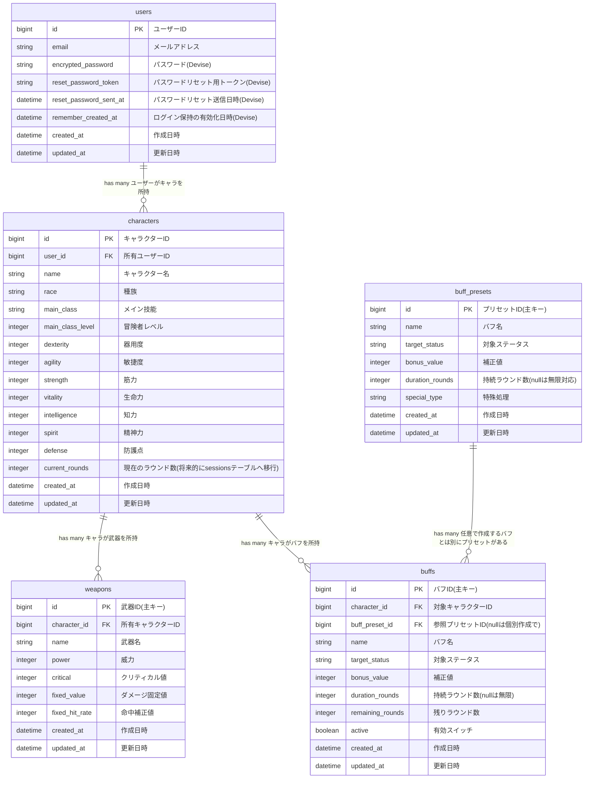

# ER図

## テーブル概要

| テーブル名 | 役割 |
| --- | --- |
| users | ログインユーザー。Deviseでの認証管理 |
| characters | ユーザー所有のSW2.5キャラクター。SW2.5の基本ステータスを保持 |
| weapons | キャラクターが装備する武器。判定式の生成に使用 |
| buff_presets | よく使うバフの雛形。アプリ提供のプリセットとして全ユーザーで共有 |
| buffs | キャラクターに実際にかかっているバフの実体。プリセットから生成するか手動で直接登録できる |

## Mermaid

## 設計メモ

- **buff_presetsとbuffsの分離**：buff_presetsはアプリ全体で共有する雛形テーブルでcharacter_idを持たない。buffsはキャラクターに実際にかかっている実体のバフで、プリセットから生成した場合はbuff_preset_idを持ち、手動登録したカスタムバフはnullになる。
- **weaponsテーブルの分離**：SW2.5は武器2つ持ちの技能があるため将来的に分離できるように今から調整とした。
- **current_roundsの位置**：現在はcharactersテーブルに持たせているが、将来的に複数人セッション機能を追加する際はsessionsテーブル等を設けてそこに移行することを検討。
- **special_type**：通常の補正では表現できない特殊な処理（クリティカル値変更・ダイス目固定など）を文字列enumで区別するカラム。判定式の組み立てロジックで参照する。
- **active**：バフはオン/オフを切り替えて一時的に無効化できる。activeがfalseのバフは判定式の計算から除外される。
